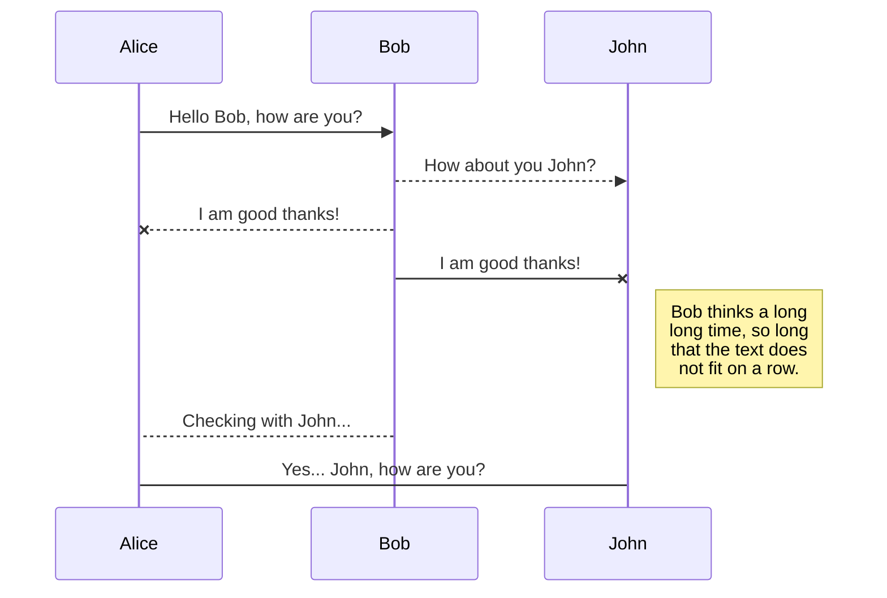
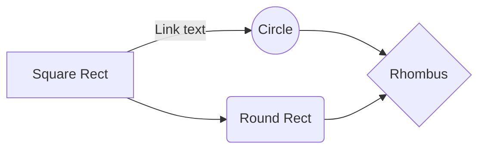

# Windows Service Summary

## 1. Create Windows Service
  [How to create windows service](https://www.c-sharpcorner.com/article/create-windows-services-in-c-sharp/)
  
## 2. Debug Windows Service
1. **UserInteractive**
	Use the following code, you can run your service via F5
	 ```
	if (!Environment.UserInteractive)
	{
		ServiceBase[] ServicesToRun;
		ServicesToRun = new ServiceBase[]
		{
			new WindowsService()
		};
		ServiceBase.Run(ServicesToRun);
	}
	else
	{
		var service = new WindowsService();
		// We need add the internal method 'Start'
		// This method will call the OnStart method.
		service.Start();
		//Sleep until end debug
		Thread.Sleep(Timeout.Infinite);
	}
	```
 2.  **Attatch to the Service Process**
		- Build the windows service with debug model
		- Install the window service
		- Attach to the process
		
		More detail steps, click [HERE](https://docs.microsoft.com/en-us/visualstudio/debugger/attach-to-running-processes-with-the-visual-studio-debugger?view=vs-2019)
 
## 3. Add the installer for Windows Service
1. How add the install in WS.
	- Open the service design page via double click service.cs file
	- Right click in design
	- Click the "Add Installer" item
	- ProjectInstaller will be added
2. Add the install event
	  - In projectInstaller, configurated the service info.
	  - Add the install event as following:
		```        
		public ProjectInstaller() : base()
		{
			InitializeComponent();
			Committed += new InstallEventHandler(CommittedEventHandler);
			AfterUninstall += new InstallEventHandler(AfterUninstallEventHandler);
			AfterInstall += new InstallEventHandler(AfterInstallEventHandler);
		}
		```        
3. Protected the config section data
We can use the following method to encrypt the sensitive info in config file.
More detail info, please see [HERE](https://www.codeproject.com/Articles/15392/Implementing-Protected-Configuration-With-Windows).
	```
        private void ProtectSection()
        {
            string sectionName = "applicationSettings/applicationSettings.Settings";//"connectionStrings";        
            string assemblyFilePath = this.GetType().Assembly.Location;

            var config = ConfigurationManager.OpenExeConfiguration(assemblyFilePath);//.OpenMappedExeConfiguration(fileMap,ConfigurationUserLevel.None);
            ConfigurationSection configSection = config.GetSection(sectionName);
            if (configSection == null)
            {
                return;
            }

            if (!configSection.SectionInformation.IsProtected)
            {
                configSection.SectionInformation.ProtectSection("DataProtectionConfigurationProvider");
            }

            configSection.SectionInformation.ForceSave = true;
            config.Save(ConfigurationSaveMode.Modified);
        }
	```
> *Note:*    
> *The Encrypt string will not be accessed after move whole application to other machine.*

## 4. Add the SetUp project for Windows Service
1. Install the Visual Studio Installer Template    
VS not install the Installer Template as the default install.
To get the installer type of projects you need to install "Visual Studio Installer Projects" extension from below urls:  
[VS 2013](https://marketplace.visualstudio.com/items?itemName=UnniRavindranathan-MSFT.MicrosoftVisualStudio2013InstallerProjects)  
[VS 2015](https://marketplace.visualstudio.com/items?itemName=VisualStudioClient.MicrosoftVisualStudio2015InstallerProjects)  
[VS 2017](https://marketplace.visualstudio.com/items?itemName=VisualStudioClient.MicrosoftVisualStudio2017InstallerProjects)

2.  **Issues:** 
Why no service register after install?
Why the install events are not triggered?
	**Root Cause:**
	> The root cause is you not add the customer action. 

	**Solution:**	
	> 1. In Solution Explorer, right-click the setup project, point to View, then choose Custom Actions. The Custom Actions editor appears.
	> 1. In the Custom Actions editor, right-click the Custom Actions node and choose Add Custom Action. The Select Item in Project dialog box appears.
	> 1. Double-click the application folder in the list box to open it, select primary output from MyNewService (Active), and click OK. The primary output is added to all four nodes of the custom actions � Install, Commit, Rollback, and Uninstall.
	> 
	> 4. Build the setup project    
[More Detail Info](https://stackoverflow.com/questions/1560407/windows-service-not-appearing-in-services-list-after-install)
3. Set the default install path to ProgramData folder
**DefaultLoaction:**
[CommonAppDataFolder][Manufacturer]\[ProductName]

## 5. Build the *.MSI file in Build Defintion
**Issues 1:**
>The project "***Service_Setup" is not selected for building in solution configuration "Release|Any CPU".
>
> **Root Cause:**
> VS Solution unchecked the Build checkbox for the Installer Template Project
**Solution:**
> Check the Build checkbox both Debug and Release in the properties of the solution file.

**Issues 2:**
> ------ Starting pre-build validation for project 'xxxxxxx' ------  
ERROR: An error occurred while validating. HRESULT = '8000000A'
  Enable build the Setup project in solution
> **Root Cause:**
> The new IDEs do not support build outside project in own process.
> **Solution:**
> It’s just a registry **EnableOutOfProcBuild** in register.
> “HKEY_CURRENT_USER\SOFTWARE\Microsoft\VisualStudio\11.0_Config\MSBuild” for Visual Studio 2012.
>“HKEY_CURRENT_USER\SOFTWARE\Microsoft\VisualStudio\12.0_Config\MSBuild” for Visual Studio 2013. 
>“HKEY_CURRENT_USER\SOFTWARE\Microsoft\VisualStudio\14.0_Config\MSBuild” for Visual Studio 2015. 
[Here](https://github.com/dixiashi/PowerShell/blob/master/8000000A_Error_Fix.ps1) are the PowerShell script to do that.

## 6. Install the Windows Service
**Use InstallUtile.exe**
> **Install**
> ```
>cd C:\Windows\Microsoft.NET\Framework\v4.0.30319
>InstallUtil.exe "C:\ProgramData\WindowsService\WindowsService.exe"
>```
> **Uninstall**
> ```
>cd C:\Windows\Microsoft.NET\Framework\v4.0.30319
>InstallUtil.exe /u "C:\ProgramData\WindowsService\WindowsService.exe" /qn /quiet /l*v UpdateLog.txt
>```
**Use Msiexec.exe**
> **Install**
> ```
>msiexec.exe /i "C:\ProgramData\WindowsService\WindowsService.exe" /qn /quiet /l*v UpdateLog.txt
>```
> **Uninstall**
> ```
>msiexec.exe /u "C:\ProgramData\WindowsService\WindowsService.exe" /qn /quiet /l*v UpdateLog.txt
>```
[Other Ways](https://stackoverflow.com/questions/450027/uninstalling-an-msi-file-from-the-command-line-without-using-msiexec)

## 7. Install the Windows Service in remote machine
**Conditions:**
1. Install account: {UserName} & {Password}
2. Start the Windows Installer service in the remote machine.

**Script**
```
InstallWindowsService -remoteComputerName $remoteComputerName  -domainUser $domainUser  -userPassword $userPassword  -msiFolder $msiFolder  -serviceName $serviceName
```
[PowerShell Script](https://github.com/dixiashi/PowerShell/blob/master/InstallWindowsService.ps1)


## UML diagrams

You can render UML diagrams using [Mermaid](https://mermaidjs.github.io/). For example, this will produce a sequence diagram:



And this will produce a flow chart:


